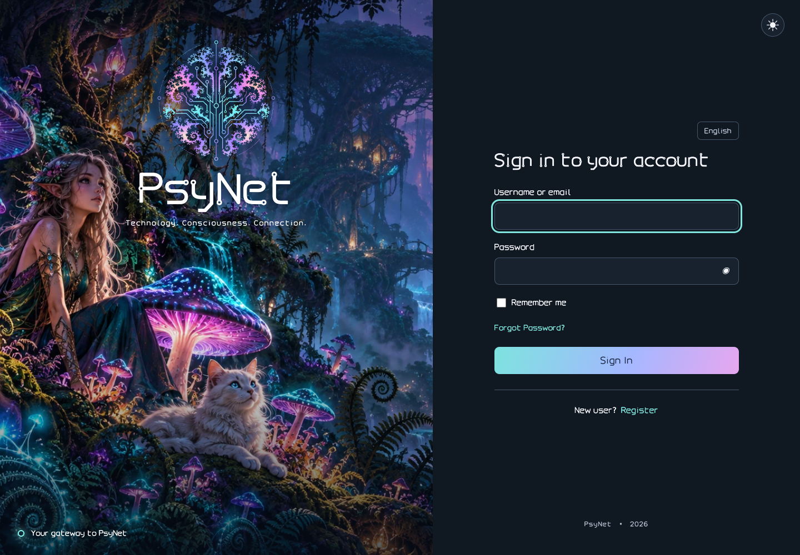
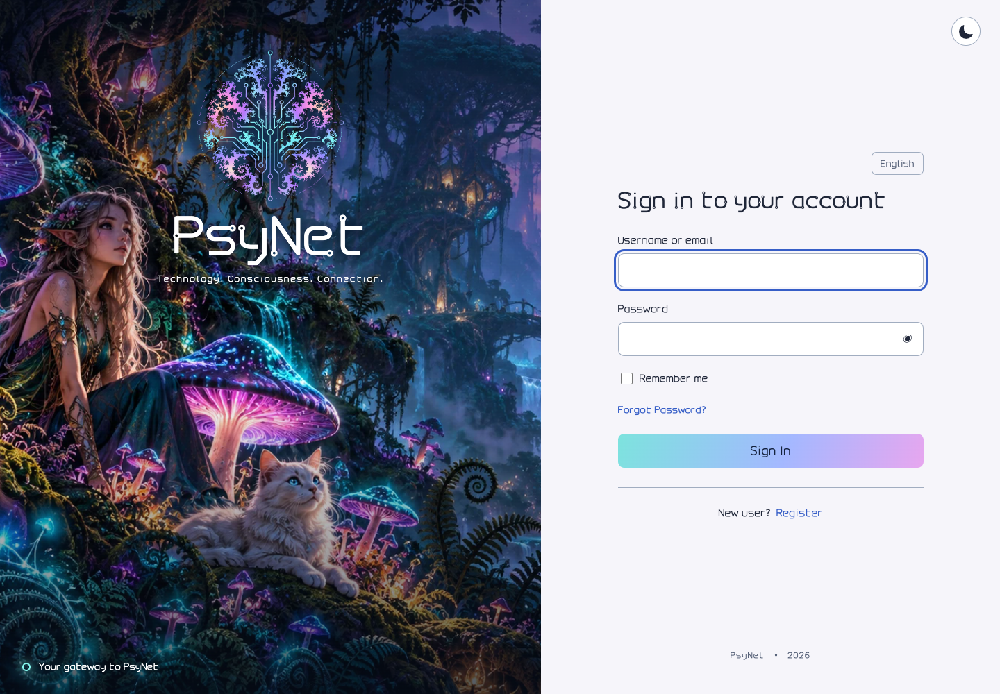

# PsyNet · Keycloak theme suite

Светлая и тёмная темы **Keycloak 26.x** для login, account, admin и email. Login построен на Keycloakify 11.16.1. Фрактальный логотип и дорожки платы, шрифты PsyNet Sans / Circuit с латиницей, кириллицей и греческим, психоделический лес с волшебными грибами, котами и эльфами. Цвета фона и логотипа сохраняются в обеих схемах; переключатель меняет поверхность формы и текст.





## Что публикуется

`ghcr.io/raider444/keycloak-psynet-design` — минимальный **образ для init-container**, который копирует JAR темы и завершается. Это не образ сервера Keycloak.

В финальном образе — закреплённый multi-platform BusyBox 1.37.0-musl, `/theme/psynet-keycloak-26.jar`, SHA256 и shell-скрипт. Нет Node.js, Java, Maven, исходников или отдельных копий фоновых изображений. Весь необходимый фронтенд и ассеты уже внутри JAR. `.dockerignore` разрешает попадание в build context только установочных файлов. Размер JAR около 13 MB; точный размер образа зависит от платформы и сжатия слоёв.

Платформы: `linux/amd64`, `linux/arm64`. По умолчанию образ работает как UID/GID 1000; допускается другой non-root UID/GID с правом записи в каталог назначения. Внутри образа `/theme` имеет права `0555`, JAR и SHA256 — `0444`. Проверяет SHA256 исходного JAR, копирует файл с правами `0644`; по умолчанию назначение `/target`, другое можно передать первым аргументом.

## GitHub Actions → GHCR

Workflow [`.github/workflows/publish.yml`](.github/workflows/publish.yml):

1. `npm ci`, Chromium-проверки интерфейса, TypeScript/Vite/Keycloakify/Maven-сборка.
2. Проверка целостности JAR, списка тем, ключевых страниц и ассетов; создание SHA256.
3. Интеграционные проверки установленного JAR на Keycloak 26.0.8 и 26.8.0: вход, сохранение профиля, admin console и HTML/text письма через локальный SMTP-приёмник. Затем сборка образа и проверка копирования от non-root с read-only корневой файловой системой.
4. Сохранение JAR и SHA256 в Actions artifacts.
5. Отдельная job публикует multi-platform образ в GHCR через автоматически выдаваемый `GITHUB_TOKEN` с `packages: write`.
6. Опубликованный образ по digest проверяется на обеих платформах: копирование с UID 1000 и произвольным non-root UID, права `0644` и отказ при неверном SHA256.

Pull requests только проверяются; публикация выполняется на push в `main`, на тег `v*` и при ручном запуске. Actions и базовый образ закреплены SHA/digest. PAT или registry password в secrets для этого pipeline **не нужны**.

| Событие | Теги образа |
| --- | --- |
| Push в main | `latest`, `sha-<полный SHA коммита>` |
| Тег v1.2.3 | `1.2.3`, `1.2`, `sha-<полный SHA коммита>` |
| Ручной запуск | SHA и `latest`, если выбран main |

GitHub → Settings → Actions → General: разрешите Actions и используемые `actions/*` / `docker/*`, если они ограничены политикой. Право публикации указано в workflow. Если package с таким именем уже существует, дайте этому репозиторию доступ в package **Manage Actions access**.

После первой публикации package может быть **private**, даже у публичного репозитория. Для анонимного pull сделайте package публичным в его настройках. Иначе используйте `imagePullSecrets`. Рекомендуемый production reference — `ghcr.io/raider444/keycloak-psynet-design@sha256:<digest>` из summary publish job; тег SHA коммита тоже удобен для идентификации сборки.

## Semantic version релизы

В Actions выберите **Semantic version release → Run workflow → main → patch / minor / major**. Workflow вычисляет следующую стабильную версию по максимальному тегу `vX.Y.Z`; до первого тега базой служит `package.json` (`1.0.0`). Например, первый `minor` выпустит `1.1.0`. Prerelease-теги не участвуют в расчёте; этот workflow выпускает стабильные версии без суффиксов.

Выбранный SHA фиксируется до сборки. После всех проверок workflow публикует GHCR-теги `X.Y.Z`, `X.Y`, `sha-<SHA>` и `latest`, затем создаёт GitHub Release `vX.Y.Z` с JAR, SHA256, автоматически сгенерированными release notes и digest образа. Существующие теги не перемещаются. Версия доставки задаётся тегом релиза; `package.json` остаётся базовой версией проекта, workflow не создаёт скрытых коммитов в main.

Используется только `GITHUB_TOKEN`: `packages: write` для образа и `contents: write` только в job создания релиза. Тег, созданный этим токеном, не запускает второй workflow; сборка вызывается напрямую через `workflow_call`. Обычный push `vX.Y.Z` также собирает версионный образ, но для GitHub Release с вложениями используйте **Semantic version release**. PR не публикует образ и не создаёт релиз.

## Подключение к Keycloak Operator

Добавьте фрагмент из [`examples/keycloak-theme.yaml`](examples/keycloak-theme.yaml) в **существующий** Keycloak CR. Сохраните текущие DB, hostname, TLS, количество экземпляров и другие параметры. Фрагмент не является полным новым deployment. Для ранних Keycloak Operator 26.x обычно используется `k8s.keycloak.org/v2alpha1`; выберите реально обслуживаемую CRD API-версию вашего оператора:

```sh
kubectl get crd keycloaks.k8s.keycloak.org \
  -o jsonpath='{range .spec.versions[?(@.served==true)]}{.name}{"\n"}{end}'
```

Существенные добавления:

```yaml
spec:
  startOptimized: false
  unsupported:
    podTemplate:
      metadata:
        annotations:
          psynet.su/theme-version: "replace-with-release-or-image-digest"
      spec:
        securityContext:
          fsGroup: 1000
        initContainers:
          - name: install-psynet-theme
            image: ghcr.io/raider444/keycloak-psynet-design:latest
            imagePullPolicy: Always
            args: ["/target"]
            securityContext:
              runAsNonRoot: true
              runAsUser: 1000
              runAsGroup: 1000
              allowPrivilegeEscalation: false
              readOnlyRootFilesystem: true
              capabilities:
                drop: ["ALL"]
            volumeMounts:
              - name: psynet-theme
                mountPath: /target
        containers:
          - name: keycloak
            volumeMounts:
              - name: psynet-theme
                mountPath: /opt/keycloak/providers/psynet-keycloak-26.jar
                subPath: psynet-keycloak-26.jar
                readOnly: true
        volumes:
          - name: psynet-theme
            emptyDir:
              sizeLimit: 32Mi
```

Init-container заполняет отдельный `emptyDir` перед стартом Keycloak. Один файл монтируется через `subPath`, поэтому остальные JAR в `/opt/keycloak/providers` остаются видимыми. На каждой реплике тема устанавливается независимо. Полная версия примера включает ресурсы и seccomp.

`fsGroup` обеспечивает запись в том `/target`; `runAsUser` и `runAsGroup` в примере относятся только к init-container. Существующий securityContext основного контейнера Keycloak менять не требуется. Образ темы указывается только в `initContainers`, сервер Keycloak сохраняет свой серверный образ.

Если появляется `/usr/local/bin/copy-theme: ... can't cd to /theme: Permission denied`, обновите образ темы: в ранней публикации каталог `/theme` ошибочно получал права `0444`. Это ошибка прав внутри образа; изменение `fsGroup` её не исправляет. Используйте digest исправленной сборки с успешной проверкой обеих платформ и обновите annotation для rollout. Для исправления не нужны root, privileged или отключение `readOnlyRootFilesystem`.

**Почему `startOptimized: false`:** JAR появляется после сборки server image. Keycloak должен выполнить augmentation при запуске, чтобы обнаружить добавленный provider/theme. Оператор добавляет `--optimized` для некоторых конфигураций custom image; этот флаг нельзя оставлять при такой установке нового JAR. Startup augmentation увеличивает время старта. Если нужна именно оптимизированная сборка, включите JAR в образ самого Keycloak до `kc.sh build` — это другой способ доставки.

`unsupported.podTemplate` — экспериментальный механизм оператора. Пример проверен по структуре исходников Operator 26.0.0, но его нужно согласовать с вашей CRD и существующим PodSpec. Не заменяйте целиком текущие списки `containers`, `initContainers`, `volumes`, `volumeMounts` при их наличии: объедините добавления. Сохраните существующий `fsGroup`, если он уже задан; используйте совместимый `runAsGroup` и права тома. В OpenShift согласуйте UID/GID с политикой namespace.

Для private GHCR добавьте в `spec.unsupported.podTemplate.spec`:

```yaml
imagePullSecrets:
  - name: ghcr-pull
```

Secret `ghcr-pull` должен существовать в namespace Keycloak, тип `kubernetes.io/dockerconfigjson`, с login для `ghcr.io`. Для pull из GHCR используйте отдельный PAT **classic** только с `read:packages` и доступом к package; fine-grained PAT не заменяет этот registry credential. Пароль не храните в манифестах/репозитории; заведите Secret через свой менеджер секретов.

После применения изменения проверьте rollout и init-container:

```sh
kubectl -n YOUR_NAMESPACE get pods
kubectl -n YOUR_NAMESPACE logs YOUR_KEYCLOAK_POD -c install-psynet-theme
kubectl -n YOUR_NAMESPACE logs YOUR_KEYCLOAK_POD -c keycloak
```

Когда Keycloak запустится, откройте **Realm settings → Themes**, выберите `psynet-light` или `psynet-dark` отдельно для **Login theme**, **Account theme**, **Admin theme** и **Email theme**, затем Save. Все четыре типа входят в один JAR; дополнительных init-container и mount не требуется.

Эквивалентные поля существующего realm (это не Keycloak CR):

```json
{
  "loginTheme": "psynet-dark",
  "accountTheme": "psynet-dark",
  "adminTheme": "psynet-dark",
  "emailTheme": "psynet-dark"
}
```

Для `/admin/master/console/` задайте `adminTheme` в realm **master**: переключение управляемого realm внутри этой консоли не меняет realm самой консоли. Для `/admin/REALM/console/` настройте соответствующий realm. Account доступен по `/realms/REALM/account/`. Проверьте client-level override login theme, если он задан.

В **Realm settings → Email** отдельно настройте SMTP, адрес отправителя и TLS. Тема не настраивает SMTP. Выполните Test connection, отправьте verification/reset password/execute actions и проверьте письма в нужных клиентах. Письма используют публичный HTTPS-адрес Keycloak для логотипа; корректно настройте hostname и reverse proxy. Не используйте внутренний адрес Kubernetes в публичных ссылках писем.

При обновлении замените image reference на новый digest/tag и измените annotation `psynet.su/theme-version`: изменение Pod template запускает обновление Pod-ов. Одна лишь перепубликация `latest` не перезапускает уже работающие Pod-ы. Для отката верните предыдущий digest и annotation. Тема не меняет существующий realm и пользователей сама по себе.

## Разработка и локальная сборка

Требуются Node.js 22+ (CI — 24), Java 21 и Maven в PATH, Python 3. Для container-проверки нужен Docker.

```sh
npm ci
npm run dev
npm run build-keycloak-theme
python3 scripts/check-jar.py

docker build -t psynet-theme:local .
mkdir -p /tmp/psynet-theme-output
chmod 0777 /tmp/psynet-theme-output
docker run --rm --read-only --cap-drop=ALL \
  --security-opt=no-new-privileges \
  -v /tmp/psynet-theme-output:/target psynet-theme:local
cmp dist_keycloak/psynet-keycloak-26.jar /tmp/psynet-theme-output/psynet-keycloak-26.jar
```

`0777` выше применяется только к временному локальному тестовому каталогу. Kubernetes использует права тома через `fsGroup` и отдельный non-root init-container.

```sh
npx playwright install --with-deps chromium
npm run check-ui
```

Если Chromium уже установлен, задайте `PSYNET_CHROMIUM_PATH`. UI-проверки проверяют обе исходные схемы, переключение и сохранение выбора, показ/скрытие пароля, поля регистрации/сброса/OTP, отсутствие горизонтального переполнения на 390 px и ошибок JavaScript.

Локальный просмотр: `/?theme=light`, `/?theme=dark&lang=ru`, `/?page=login-reset-password.ftl&lang=ru`, `/?page=register.ftl`, `/?page=login-otp.ftl`, `/?lang=el`. При отсутствии `window.kcContext` используется mock-контекст; он не выполняет настоящую аутентификацию. В Keycloak штатный контекст содержит реальные URL и данные форм.

В UI используется Keycloakify `DefaultPage`: штатные login/register/reset/OTP/WebAuthn/social и другие страницы аутентификации. Включение этих сценариев зависит от realm. Account и admin используют штатные приложения сервера через наследование `keycloak.v3` / `keycloak.v2`; их маршруты, API и формы не заменяются. Тема не добавляет сторонние адреса отправки паролей или аналитику.

## Account, admin и email

| Пример | Светлая схема | Тёмная схема |
| --- | --- | --- |
| Account | [Просмотр](previews/keycloak-26.8.0/account-light.png) | [Просмотр](previews/keycloak-26.8.0/account-dark.png) |
| Admin | [Просмотр](previews/keycloak-26.8.0/admin-light.png) | [Просмотр](previews/keycloak-26.8.0/admin-dark.png) |
| Письмо восстановления | [Просмотр](previews/keycloak-26.8.0/email-light-password-reset.png) | [Просмотр](previews/keycloak-26.8.0/email-dark-password-reset.png) |

Console-темы добавляют лесной фон, цветной оригинальный знак, Circuit wordmark/заголовки и светлые/тёмные поверхности поверх штатного PatternFly 5. Схема консоли определяется выбранной темой realm и не зависит от настройки ОС; login сохраняет свой переключатель и `psynet-appearance`. Исходный `index.ftl` и JS консолей наследуются от установленного Keycloak, чтобы сохранять возможности конкретной версии 26.x.

Email: HTML и plain text для verification (включая код), password reset, execute actions, привязки IdP, приглашения в организацию, email update/test и событий безопасности. Тексты и темы писем наследуют переводы Keycloak; URL, срок действия, required actions и `kcSanitize` сохранены. Новые типы писем сервера наследуются от `keycloak`; HTML с импортом `template.ftl` получает оформление PsyNet.

HTML использует таблицу до 600 px, inline-цвета/отступы, Outlook conditional table и системные шрифты. Circuit-логотип — PNG из исходного SVG и лицензированного шрифта, без инверсии цветных слоёв. Если картинки заблокированы, остаются alt-текст, содержимое и рабочие ссылки. В plain text нет схемы цветов по определению; обе темы содержат полноценный текст. Почтовый клиент может принудительно перекрасить HTML в своём dark mode. Скриншоты Chromium подтверждают вёрстку, но не заменяют проверку Outlook/Gmail/Apple Mail.

Для локальной проверки установленного пакета:

```sh
npm run build-keycloak-theme
python3 scripts/check-jar.py
PSYNET_KEYCLOAK_VERSION=26.0.8 npm run check-integration
PSYNET_KEYCLOAK_VERSION=26.8.0 npm run check-integration
node --test scripts/release-version.test.mjs
```

Нужны Docker и Chromium; `PSYNET_CHROMIUM_PATH` поддерживается. Тест создаёт временные Keycloak и Mailpit с закреплёнными digest, случайными паролями и loopback-портами, затем удаляет их. Он не использует Kubernetes или ваш realm. Снимки сохраняются в `previews/keycloak-VERSION/`. Покрываются две опорные версии 26.x; после обновления сервера проверяйте свою patch-версию и необходимые сценарии.

## Материалы и изменения дизайна

- `src/login/theme.css` — схемы, типографика и адаптивная компоновка.
- `src/login/Template.tsx` — брендирование и переключатель.
- `src/login/assets/forest.webp` — сгенерированный психоделический лес, оптимизированный в WebP.
- `src/login/assets/emblem.svg` — цветные слои исходного логотипа, обрезанные до эмблемы.
- `src/login/assets/PsyNet-*.woff2` — шрифты; `FONT-LICENSE.txt` сохраняет их условия.
- `brand-originals/` — оригинальный SVG со слоями и архив шрифтов.
- `theme-src/console/` — оформление штатных консолей.
- `theme-src/email/` — HTML/text, происхождение шаблонов и лицензия upstream.
- `theme-src/brand/psynet-logo.png` — Circuit wordmark с оригинальным знаком; пересборка `npm run render-brand`.
- `scripts/package-themes.py` — объединение четырёх типов в один JAR.
- `previews/` — изображения интерфейса, в том числе мобильного.
- `AGENTS.md` — контекст и требования для дальнейшей работы.

Фон создан по описанию: magical psychedelic forest, luminous mushrooms, two cats, graceful elves, fractal ferns, cyan/violet/pink bioluminescence; no text or UI. Цветные слои не инвертируются. Надпись PsyNet и заголовки с контактными кольцами — PsyNet Circuit; основной текст — PsyNet Sans. В письмах основной текст использует Arial/Helvetica для совместимости.

## Доступ к GitHub для разработки

В GitHub Work-подключении нужны разрешения на запись содержимого и workflow этого репозитория. Если API возвращает `403 Resource not accessible by integration`, наличие прав администратора у пользователя не означает наличие таких прав у установленной интеграции. PAT в чат не присылайте.

Для локального Codex/терминала можно создать **fine-grained PAT** в GitHub → Settings → Developer settings → Personal access tokens → Fine-grained tokens:

- Resource owner: `raider444`.
- Repository access: **Only select repositories → keycloak-psynet-design**.
- Repository permissions: **Contents: Read and write**, **Workflows: Read and write**.
- Для запуска/управления Actions: **Actions: Read and write**.
- Только если нужны изменения настроек репозитория: **Administration: Read and write**.
- Metadata read добавляется автоматически. Ограничьте срок действия.

Используйте PAT в HTTPS-аутентификации Git, например через интерактивный `gh auth login --hostname github.com --git-protocol https`, затем `gh auth setup-git`. В локальном Codex аутентификация берётся из окружения/credential helper. Авторизация на вашем компьютере не предоставляет автоматически секреты отдельной cloud Work-сессии.

PAT не используется для `git@github.com:...` — этот remote требует SSH-ключа. Если SSH уже настроен, достаточно `git push -u origin main`; иначе для PAT используйте HTTPS remote. Не кладите токен в URL, файлы репозитория, сообщения или workflow. Для pipeline GHCR достаточно встроенного `GITHUB_TOKEN`.

## Проверки и ограничения

Локально проверяются сборка исходников/JAR, браузерные формы и checksum. Реальную аутентификацию и манифест нужно проверить на вашем realm после подключения: успешный/неуспешный вход, переводы, reset, регистрация и используемые факторы. Запуск CI и публикация образа подтверждаются только после успешного run в GitHub Actions.

Документация: [Keycloak themes](https://www.keycloak.org/ui-customization/themes), [GitHub token workflow triggers](https://docs.github.com/en/actions/concepts/security/github_token), [Keycloakify variants](https://docs.keycloakify.dev/features/theme-variants), [Operator advanced configuration](https://www.keycloak.org/operator/advanced-configuration), [Operator 26.0.0 custom image guide](https://github.com/keycloak/keycloak/blob/26.0.0/docs/guides/operator/customizing-keycloak.adoc), [GitHub Container registry](https://docs.github.com/en/packages/working-with-a-github-packages-registry/working-with-the-container-registry), [PAT management](https://docs.github.com/en/authentication/keeping-your-account-and-data-secure/managing-your-personal-access-tokens).
